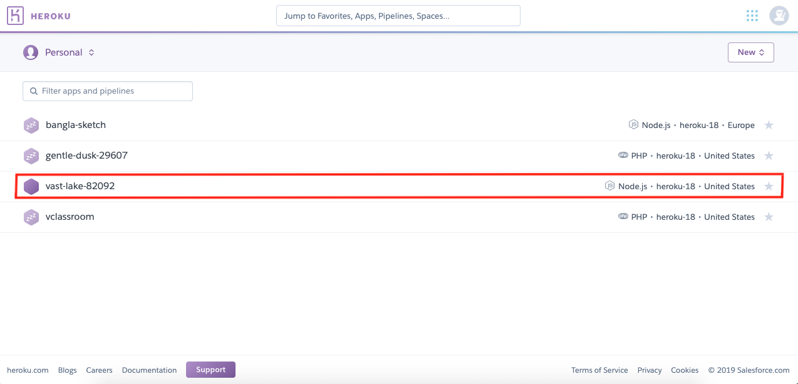
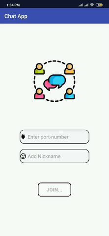

# Socket_Programming

<h2> A Chat Server System using Socket Programming </h2>

<h3> Features: </h3>

1. We have used <b>Global Server</b>. For this, we have to use <a href="heroku.com"> Heroku.com </a> as Global Server and <b> NodeJS </b> as Platform Language.  
   How we have created a Global Server (Procedures) :  
   - First I have installed a <b>Heroku CLI</b> to use heroku commands on locally using terminal. On terminal:
   <pre>
   heroku login  
   heroku create
   </pre>
      This <b>heroku create</b> command creates a new app for you. For me, It created app named <b>vast-lake-82092</b>.  
        
   - In Documentation Sector of <a href="heroku.com">Heroku.com</a> , I have selected NodeJS beacuse NodeJS is compatible           with Android/JAVA JSON Request. Then I have completed <b>Introduction</b>, <b>Set Up</b>, <b>Prepare the App</b>, <b>Deploy the App</b>, <b>View Logs</b>, <b>Define a Procfile</b>, <b>Declare App Dependencies</b> and <b>Run the app locally</b> phases of <a                           href="https://devcenter.heroku.com/categories/nodejs-support">Getting Started on Heroku with Node.js</a>. 
   - It has created a Simple default Application provided by <b>Heroku Community</b>.
   - Then locally I have installed <a href="https://www.npmjs.com/">npm packages </a>. I have used expressJS as Node platform and ejs as Templating Engine.
   - Then in <b>index.js</b>, I have deleted all existing code and replacing with my one. This for creating <b>vast-lake-82092</b> as a Global Server. 
   - I have used port 5000 (recommended by heroku) for .env file from my project.
   <pre>
   app.set('port', (process.env.PORT || 5000));
   </pre>
   - Also used <b>http</b> and <b>socket.io</b> packages provided by ExpressJS.  
   <pre>
   var http = require('http').Server(app);  
   var io = require('socket.io')(http);
   </pre>
   and main server code :  
   <pre>
   io.on('connection', function(socket){
      console.log('User Conncetion');
      socket.on('connect user', function(user){
         console.log("Connected user ");
         io.emit('connect user', user);
      });
      socket.on('on typing', function(typing){
         console.log("Typing.... ");
         io.emit('on typing', typing);
      });
      socket.on('chat message', function(msg){
         console.log("Message " + msg['message']);
         io.emit('chat message', msg);
      });
   });
   </pre>
   - Then it's ready for use.
   - When the server system is loaded, it will initiate all the required communication setup by default, no need to give port or ip address so that a client system can join it.
   
    
2. In our Client Side Android application, there is a option named <b>Port Number</b> in where you have to give port number of our global server which is <b>5000</b>. There is also a <b>Name</b> option where you can give anonymous name. :)  
   
3. We have a beautiful GUI (ListView) to show exchanged messages, also have EditText to write text and a Send Button.  

4. Each time Send is pressed with a new message in APK, all of the users connected to the server will immediately see the new message.  

5. In GUI, there exists a menu item having <b>Connected Users</b>, <b>Save Exchanged Messages</b> and <b>Show Saved Messages</b> options. In <b>Connected Users</b>, you can see all the users who is connected or not.  
   
6. By clicking <b>Save Exchanged Messages</b>, you can save your Exchanged messages to Database. To see what you have saved, you can click <b>Show Saved Messages</b> to see all saved messages.  
> We have used <b>SQLite Database</b> for storing Data. For this, we have used <b>SQLiteHelper</b> method to implement database system.

  

<h3>Extra Features: </h3>
<li> I have used Global Server instead of Local Server. That means, If we want to chat with one another, we don't have to be on same Machine (On Laptop, multiple instances). We can chat with one another from globally using Socket Programming. 
</li>
<li>
In Message Activity, we can see <b>who is typing right now</b> and also <b>who is connected or disconnected</b> stuffs.
</li>
<li>
   Stylish <b>Chat App</b> Android Application with Beautiful GUIs.
</li>
   
  
Developed By :  
<b>Masum Ahmed EeSha</b> | 2016331028 (Serving Global Host, Creating General Client System, Layout, Integrating API, Database Management)  
<b>Mushtaq Shahriar Rafee</b> | 2016331098 (Creates Menu items with options, Styling APK)
 
<h4> THANK YOU </h4>
